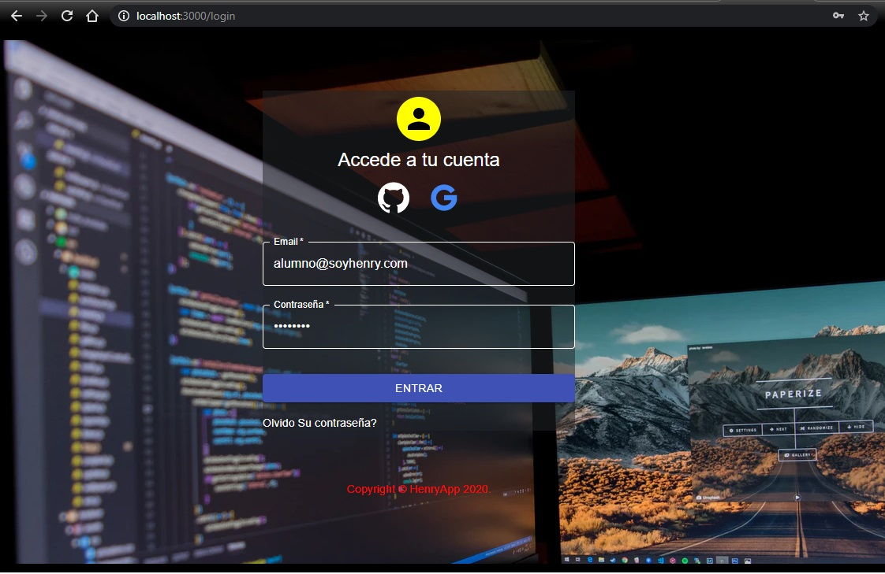
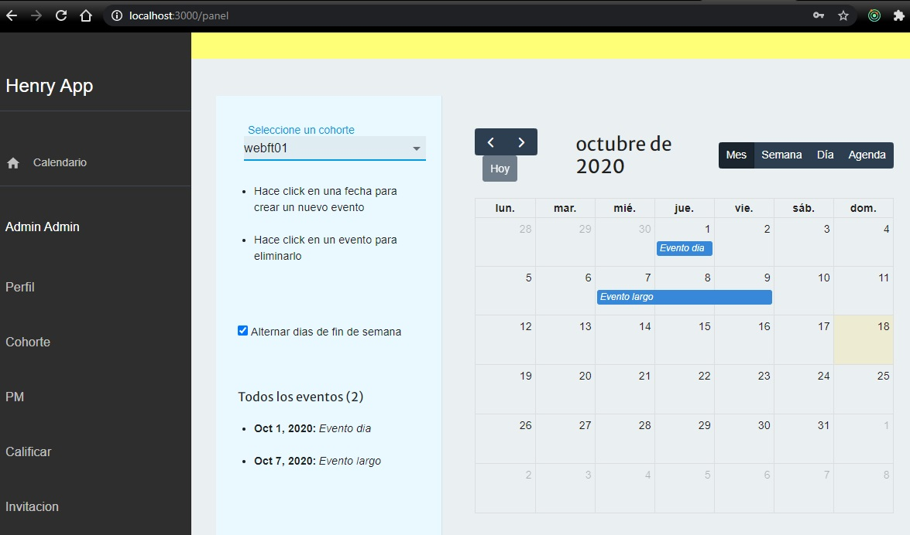
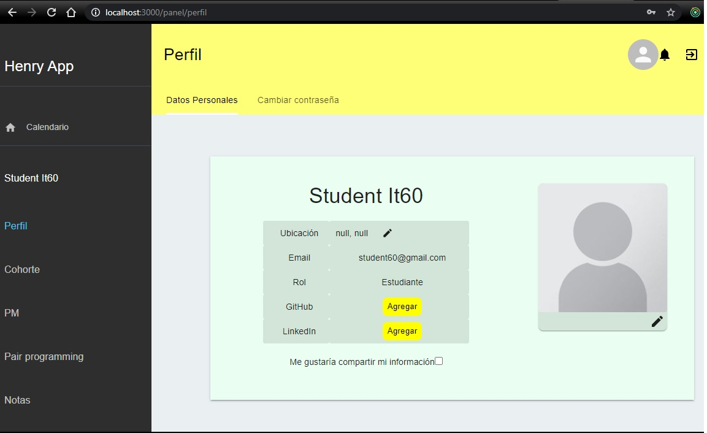

    

# HenryApp

This is a student project we made as part of our education at [Soy Henry](https://www.soyhenry.com/), which consisted of creating a full-stack React application from scratch.

### Our stack of technologies:

- Front End:
    + HTML - CSS - Javascript
    + React
    + Material UI
    + Redux

- Back End:
    + Node.js
    + Express
    
- Database: 
    + Sequelize
    + PostgreSQL

# How to start the project:

If you want to see the page for yourself, you'll need to do the following:

- Clone the repository 

- Install [PostgreSQL](https://www.postgresql.org/) on your computer and create a database called `henryapp`.

- Create a `.env` file in in the `api` folder with the following contents:

DB_USER={Your postgreSQL user}
DB_PASSWORD={Your postgreSQL password}
DB_HOST=localhost

- The default admin is:
Email: admin@admin.com
Password: Henry1234

# Previews

### Home page:

### Login:

### Admin Panel:

### User Panel:
